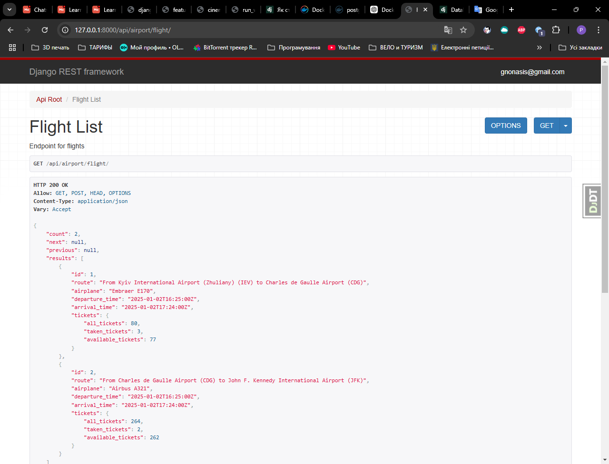

# Airport Service API: A Django REST Framework Project

API service for managing airport-related operations. This project, built with
Django REST Framework (DRF), provides features for managing flights, routes, 
tickets, and more with a user-friendly interface for both regular users and 
administrators.

## Requirements
- Python 3.10
- PostgreSQL
- Django REST Framework
- Docker

## Installing using GitHub
1. Install PostgreSQL and create a database.
2. Clone the repository and set up the virtual environment:
```bash
   $ git clone https://github.com/Roman-Sokolov-V/airport-service.git
   $ cd airport-service
   $ python -m venv venv
   $ source venv/bin/activate  # On Windows, use venv\Scripts\activate
   $ pip install -r requirements.txt
```

3. Configure environment variables:

 * Open the env.sample file and input the correct data for your environment.
 * Rename the file to .env

4. Apply migrations and create a superuser:

```bash
  $ python  manage.py migrate
  $ python manage.py runserver
  $ python manage.py createsuperuser
```
Enter an email and password to complete the superuser creation process.

---

## Run with docker
1. Install and start Docker. Follow the [Docker installation guide](https://docs.docker.com/).
2. Run Doker Desktop
3. Build and start the project:

```bash
  $ docker-compose build
  $ docker-compose up
```
4. Create a superuser:
```bash
  $ docker-compose exec -it airport sh
  $ python manage.py createsuperuser
```
Enter an email and password to complete the superuser creation process.
___
## Features

- **Authentication**: JWT-based user authentication.
- **Admin Panel**: Manage all entities via the built-in Django admin interface.
- **Documentation**: Available at:
  - Swagger: `/api/schema/swagger/`
  - ReDoc: `/api/schema/redoc/`
- **Core Features**:
  - Manage orders and tickets.
  - Filter routes and flights by countries, cities, and airports.
  - Create flights, routes, airports, cities, countries, planes, and crew via 
the admin interface.


## API Endpoints

### Public Endpoints
- Register: `/api/user/register/`
- Token: `/api/user/token/`

### Admin and authenticated user Endpoints
- Airplane Types: `/api/airport/airplane-type/`
- Airplanes: `/api/airport/airplane/`
- Countries: `/api/airport/country/`
- Cities: `/api/airport/city/`
- Airports: `/api/airport/airport/`
- Routes: `/api/airport/route/`
- Crew: `/api/airport/crew/`
- Flights: `/api/airport/flight/`
- Orders: `/api/airport/order/`


## Getting Access

1. **Register a new user**:  
   Visit `your_host/api/user/register/` and fill in the registration form (email, password, first and last name).

2. **Get an access token**:  
   Use your credentials at `your_host/api/user/token/` to get an authentication token.

3. **Access user-specific information**:  
   - Current user details: `your_host/api/user/me/`.

4. **Admin Features**:  
   After registering as an admin, you can create, update, or delete the following:
   - Flights
   - Routes
   - Airports
   - Cities
   - Countries
   - Aircraft
   - Crew
___
## How to use
After completing the steps in the paragraphs [Installing using GitHub](#installing-using-github) or
[Run with docker](#run-with-docker), you already have an admin user. Unlike a regular user, this
user can create,update or delete flights, routes, airports, cities, countries,
aircraft, aircraft types, crew. A normal user can only view this data,
create orders, and buy tickets.To create such a user, enter the following
address in your browser
your_host/api/user/register/
In the window that opens, enter the user's email, password, first and last
name. After registration you can get your token with address
your_host/api/user/token/
An authorized user has access to the following addresses:

* "airplane-types": "http://127.0.0.1:8000/api/airport/airplane-type/",
* "airplanes": "http://127.0.0.1:8000/api/airport/airplane/",
* "countries": "http://127.0.0.1:8000/api/airport/country/",
* "cities": "http://127.0.0.1:8000/api/airport/city/",
* "airports": "http://127.0.0.1:8000/api/airport/airport/",
* "routes": "http://127.0.0.1:8000/api/airport/route/",
* "crew": "http://127.0.0.1:8000/api/airport/crew/",
* "flights": "http://127.0.0.1:8000/api/airport/flight/",
* "orders": "http://127.0.0.1:8000/api/airport/order/"

#### Note: This host http://127.0.0.1:8000 is provided for example purposes only.

#### Note: The user can see a list of only their own orders

#### Note: you can add at the end of the address ID to see details.

For example:

* http://127.0.0.1:8000/api/airport/flight/5/

#### Note: Filtering is available for routes and flights.

For example:

* http://127.0.0.1:8000/api/airport/route/?cities=paris-london
  in this case there will be a list of all routes where source city is Paris and
  destination is London. filtering is case-insensitive
* http://127.0.0.1:8000/api/airport/flight/?contries=usa-france
  in this case there will be a list of all flights where source country is USA
  and destination is France
* http://127.0.0.1:8000/api/airport/flight/?airports=1-2
  in this case there will be a list of all flights where source airport is
  airport with id = 1 and destination with id = 1. Id's of airports you can find
  by "http://127.0.0.1:8000/api/airport/airport/

If you authenticated as an admin (superuser), you can also not only view
information but also change, delete and create new ones.
___





Links:  
This project on GitHub  https://github.com/Roman-Sokolov-V/airport-service


